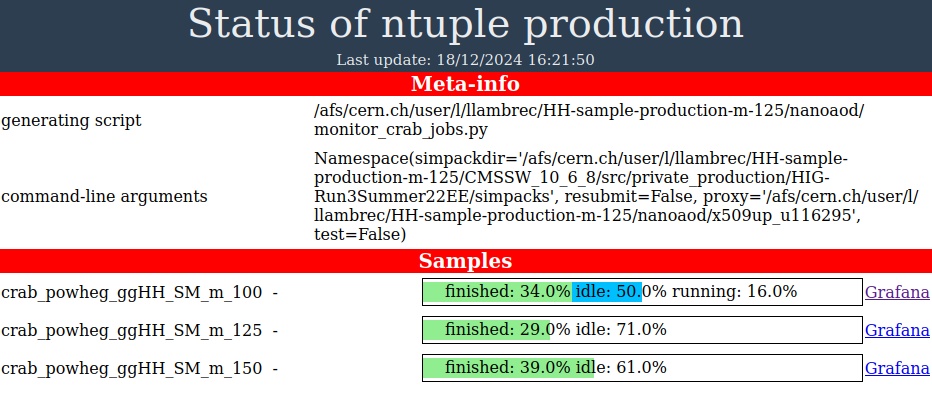

# HH sample generation with different H masses


### Preamble
See instructions here:
- [README by Fabio Monti](https://gitlab.cern.ch/hh/hhgridpacks) (for gridpack generation)
- [CMS Generator central place: POWHEG BOX](https://cms-gen.gitbook.io/cms-generator-central-place/how-to-produce-gridpacks/powheg-box) (for gridpack generation)
- [Private production repo by Evan Koenig](https://github.com/ekoenig4/private_production) (for NanoAOD sample production)
- [HH4b ntuplizer](https://gitlab.cern.ch/gouskos/hh4b_run3/-/tree/run2?ref_type=heads) (for ntuple production)

See also Thomas' lab notes for additional instructions!

**lxplus vs T2B:** So far, the procedures below have been developed and tested both on lxplus and my local (Belgian) T2B.
(To do: repeat on both systems after this repository has reached a more mature and stable state).
Small modifications are needed depending on the system, mostly boiling down to running the same commands in a container that sets the environment right.
Where applicable, differences between lxplus and T2B are detailed in the steps below.

**Open questions:** Before moving on to mass production of samples, some open questions need to be resolved:
- Double-check settings in powheg input card with experts, in particular the `hwidth` and `hdecaywidth` setting.
- Double-check whether the `creategrid.py` file must be tweaked to change the H mass.
- Double-check H mass setting in Pythia fragment.
- Double-check `POWHEG:nFinal` setting in Pythia fragment.
- Find out how to set appropriate detector conditions.


## Installation of this repository
Git clone this repository:

```
git clone https://github.com/LukaLambrecht/HH-sample-production.git
```

When installing multiple copies of the repository side by side (e.g. for generating multiple gridpacks in parallel with different H mass values, see also below), you can specify a unique name for each. For example:

```
git clone https://github.com/LukaLambrecht/HH-sample-production.git HH-sample-production-m-100
```


## Setting up the gridpack generation software
Set up a suitable CMSSW release and git clone the `genproductions` repository (fork by Fabio Monti) into it. All of this preferably inside the `HH-sample-production` folder to keep things orderly, but not necessarily. The basic command sequence goes as follows:

```
cd HH-sample-production
cmsrel CMSSW_10_6_8
cd CMSSW_10_6_8/src/
cmsenv
git clone https://github.com/fabio-mon/genproductions
```

Switch to the correct branch.

```
cd genproductions
git checkout -b POWHEGggHH_cmssw106x origin/POWHEGggHH_cmssw106x
```

**Specific for lxplus:** The installation as detailed above does not work on lxplus,
since `CMSSW_10_6_X` is not compatible with the default lxplus architecture.
Therefore, just before installing CMSSW, do `cmssw-cc7` to switch to a suitable container.
Then follow exactly the same steps as above. When ready, you can exit the container again using the `exit` command.

**Efficient checkout:** The `genproductions` repo is quite big, which can lead to network-related errors during cloning.
In order to avoid those (or just to save space), you can replace the standard `git clone` above by:

```
git clone https://github.com/fabio-mon/genproductions --depth 1 --branch POWHEGggHH_cmssw106x
```

This will download only the required branch and ignore the git history.
When you use this kind of clone, there is also no need anymore to checkout the specific branch, since it is already set during cloning.

One could further reduce the disk space and cloning time of the repo by using the `sparse-checkout` feature in git, as follows:

```
git clone https://github.com/fabio-mon/genproductions --depth 1 --branch POWHEGggHH_cmssw106x --no-checkout
cd genproductions
git sparse-checkout set .github bin/Powheg
git checkout
```

Note that this might not work with older git versions.

**For convenience:** All of these steps can be done slightly more conveniently in one go by running `./install-genproductions.sh` from inside the `HH-sample-production` main directory. On lxplus, this needs to be run in a `cmssw-cc7` container as explained above, or alternatively you can run the dedicated `./install-genproductions-lxplus.sh` script that automatically opens a suitable container to run the CMSSW installation in.

**Specific for T2B:** Some tweaking of the working directory settings seems to be needed (after installation, before running the next steps),
probably because of different settings HTCondor between lxplus and T2B.
Run the following:

```
cd tools
./tweak_workdir_t2b.sh ../CMSSW_10_6_8/src/genproductions/bin/Powheg
```

This basically replaces `cd -` in the job template script by `cd /tmp`, where `/tmp` is a temporary working directory on the T2B nodes (also works on the interface machines).


## Compile an input file
The basic command sequence to follow is shown below:

```
cd bin/Powheg/
python ./run_pwg_condor.py -p 0 -i <input file> -m ggHH -f <name of working directory> --svn 4038
```

In this command, `-p 0` specifies that the step to be run is the compilation (as opposed to e.g. `-p 1`, `-p 2` and `-p 3` which are steps in the calculation, or `-p 9` which is the final packing of the tarball). The argument `-i` specifies the powheg input file (containing all configuration parameters), `-m` specifies the Powheg process, `-f` is used to choose a working directory where intermediate results will be stored. For the `--svn` argument, see [Fabio's intructions](https://gitlab.cern.ch/hh/hhgridpacks).

Notes on parallelization of this step:
- For creating gridpacks at many mass values, some parallelization is probably needed.
- The Powheg compilation step seems to modify not only its specified working directory, but also some other files/variables. To keep things safe, it is probably best to run only one compilation and calculation per project. Parallelization is possible by installing multiple versions of this repository next to each other and generate one gridpack in each.

**For convenience:** the compilation can be more conveniently configured (e.g. modify the mass in the input file) and wrapped in a condor job.
See the `compilation` directory. Run `python compilation.py -h` to see a list of command line options.
Example use:

```
cd compilation
python3 compilation.py -i powheg_ggHH_SM.input -m 100 -w ../CMSSW_10_6_8/src/genproductions/bin/Powheg/workdir_powheg_ggHH_SM_m_100 -r local
```

This will use the vanilla input file `powheg_ggHH_SM.input`, modify the mass to 100 GeV, and use the specified working directory.
Use `-r condor` to run in a condor job instead of `-r local` to run in the terminal.
There is also a `--preparegrid` argument available, see the next paragraph.

Note: the instructions do not cover a change in the H mass.
This can probably be done by modifying the `.input` file above (it has an `hmass` parameter).
Not sure if that is the only required change though; to be verified.
It seems that apart from the mass, also the `hwidth` has to be set explicitly (otherwise the calculation keeps running forever), but not yet sure which value to choose.
As the samples will only be used for MVA training, keeping the SM width for all masses is probably fine.

Note: the `.input` file above does not yet specify the decay of the H bosons.
It has a H decay mode parameter `hdecaymode` set to `-1`, i.e. close all decay channels).
So the H boson is considered stable as far as this step goes.
The decay to bb is probably specified in the Pythia configuration later on.

**Specific for lxplus:** because of the incompatibility between the default lxplus architecture and `CMSSW_10_6_X` (see above), this step needs to be run in an `el7` container. Yet, contrary to the case above for `cmssw-cc7`, we cannot use the standard `cmssw-el7` script since it does not have access to HTCondor. Therefore, a customized script `start_el7_container.sh` is needed. For running the compilation in the terminal, one can start an interactive `el7` container wth HTCondor access by doing `cd tools; ./start_el7_container.sh` and then running the above commands either manually or using `python compilation.py -i <input file> -m <mass> -w <working directory> -r local`. You can exit the container with the `exit` command. For running it in a job, use `python3 compilation.py -i <input file> -m <mass> -w <working directory> -r condor --el7` (you do not have to be in a container to run this command, just specify the `--el7` option).


## Preprocess the grid files
Do the following:

```
cd <your chosen working directory>
```

and then

```
sed -i -e 's/import lhapdf/#import lhapdf/g' -e 's/pdf=lhapdf.mkPDF(lhaid)/#pdf=lhapdf.mkPDF(lhaid)/g' -e 's/alphas = pdf.alphasQ2(muRs)/alphas = 0.0 #alphas = pdf.alphasQ2(muRs)/g'  creategrid.py
chhh=$(awk 'sub(/^chhh/,""){printf "%+.4E", $1}' powheg.input)
ct=$(awk 'sub(/^ct /,""){printf "%+.4E", $1}' powheg.input)
ctt=$(awk 'sub(/^ctt/,""){printf "%+.4E", $1}' powheg.input)
cg=$(awk 'sub(/^cggh /,""){printf "%+.4E", $1}' powheg.input)
cgg=$(awk 'sub(/^cgghh/,""){printf "%+.4E", $1}' powheg.input)
gridtemp="Virt_full_${chhh}_${ct}_${ctt}_${cg}_${cgg}.grid"
pythoncmd="import creategrid as cg; cg.combinegrids('${gridtemp}', ${chhh}, ${ct}, ${ctt}, ${cg}, ${cgg})"
python3 -c "$pythoncmd"
```

This creates a `.grid` file named `Virt_full_+1.0000E+00_+1.0000E+00_+0.0000E+00_+0.0000E+00_+0.0000E+00.grid` in the chosen working directory.

Note: the above commands assume that the EFT parameters `chhh`, 'ct', 'ctt', 'cg' and 'cgg' are explicitly defined in the powheg `.input` file. This is because this step is based on [Fabio's intructions](https://gitlab.cern.ch/hh/hhgridpacks) with EFT as use case. If these parameters are not defined in your input file, you can use the convenience script below that uses the SM value as a default for each of them.

**For convenience:** these grid preprocessing steps can be run in one go using the script `preprocess_grid_files.sh` in the `tools` subdirectory. It takes one cmd-line arg, namely the working directory. So in this case:

```
cd tools
./preprocess_grid_files.sh ../CMSSW_10_6_8/src/genproductions/bin/Powheg/workdir_powheg_ggHH_SM_m_100
```

Alternatively, one can just add the `--preparegrid` argument to the compilation script (see the previous paragraph), which simply runs the `./preprocess_grid_files.sh` script right after compilation. 

**Specific for lxplus:** it is advised to run these preprocessing steps in an `el7` container just like the previous step.
Simply use the `./start_el7_container.sh` script before running the preprocessing steps.

Note: in the script `creategrid.py` (inside the working directory), the H mass seems to be hard-coded at 125!
Potentially this needs to be patched as well, to ask around.
This might be the cause for crashes observed when running at mass 100.
To include this patch, just pass a second argument to the `./preprocess_grid_files.sh` script, namely the new mass value, so for example:

```
cd tools
./preprocess_grid_files.sh ../CMSSW_10_6_8/src/genproductions/bin/Powheg/workdir_powheg_ggHH_SM_m_100 100
```

This patch is automatically included in the `compilation.py` script if you set the `-m <mass value>` and `--preparegrid` argument.


## Run the calculation and make the gridpack
See [Fabio's intructions](https://gitlab.cern.ch/hh/hhgridpacks) for the baseline commands to follow.

Some remarks:
- The first step (`-p 1`) is repeated several times with different loop numbers (`-x <1 to 5>`). The number of repititions seems to be free to choose. The more loops, the more refined the final grid will be.
- To investigate whether increasing the number of jobs (`-j`) reduces their runtime, maybe in combination with the number of events (`-n`) argument.
- Since the `hwidth` (or maybe the `hdecaywidth`) are explicitly set in the powheg input file, runtimes seem to be extremely short (much shorter than what is mentioned by Fabio), while event generation still seems to work fine at first sight. Without setting these parameters, runtimes seemed to be never-ending. To discuss with experts.

**For convenience:** it is quite annoying to monitor all these iterations manually and submit the next batch of jobs when the previous one is done (especially in the case of many gridpacks).
Therefore, an attempt to automate this procedure has been made.
Still in development, it does not work perfectly yet.
But the basic idea is to set up a cron job that monitors the output of `condor_q`.
Follow these steps (on T2B, for lxplus, see some slight modifications below):

```
cd gridpack-generation
python3 make_powheg_commands.py -i <path to your powheg input file from the previous steps> -w <path to your powheg working directory from the previous steps> -o <choose an output .txt file name>
```

This generates the chosen output file, that is simply a txt file with the powheg commands to run (and some auxiliary things, like `cd` and `cmsenv`).
Now do the following:

```
python3 run_powheg_commands.py -i <the .txt file with powheg commands from the previous step> -n <choose a name tag for log and executable files>
```

This generates a new log file and also prints some instructions on how to proceed.
You can now just repeat the same command as above whenever you want, or add it in your crontab file.
Running this command will check if condor jobs associated with the current step are still running, and if not submit the next step.

Note: do not modify or remove the log file named `log_<chosen name>.txt` until the whole sequence is finished, as it is used by the script to retrieve the job status and decide what next action is appropriate.
The file `log_<chosen name>_full.txt` is for information/debugging only and could be removed if desired.

Note on parallelization of this step: as with the compilation, it is best to run multiple gridpacks in multiple projects. Moreover, it is probably a good idea to stagger the cron jobs in suchs a way that new condor jobs are not submitted at exactly the same time for different projects, as this could potentially confuse the bookkeeping.

**Specific for lxplus:** a few modifications have to be made on lxplus.
The powheg commands have to be run from and `el7` container just as before.
Either start an `el7` container with `./start_el7_container.sh` in `tools` when running command by command interactively,
or add the `--el7` argument to the `run_powheg_commands.py` when running the convenience scripts.
And finally, since regular `cron` is not accessible on lxplus, use 'authenticated cron' with the `acrontab -e` command.
The syntax is exactly the same as regular cron, except for an extra field `lxplus.cern.ch` between the time specifiers and the command(s) to run.


## Check the gridpack
See [Fabio's intructions](https://gitlab.cern.ch/hh/hhgridpacks) for the baseline commands to follow.

**For convenience:** The script `check_gridpack.py` (in the `gridpack_generation` folder) can be used for this step. It wraps the appropriate powheg command in an HTCondor job.
Example usage:

```
python3 check_gridpack.py -g ../CMSSW_10_6_8/src/genproductions/bin/Powheg/ggHH_slc7_amd64_gcc700_CMSSW_10_6_8_workdir_powheg_ggHH_SM_m_100.tgz -n 10
```

This will generate an `.lhe` file with 10 events and copy it to the `gridpack-generation` folder so it can be opened and inspected.

**Specific for lxplus:** Same as before. If running interactively, do it inside a container started with `tools/start_el7_container.sh`. 
If running in a job, just add the `--el7` argument to the `check_gridpack.py` command.


## Setting up the sample production software

Clone the `private_production` repository as follows:

```
cd CMSSW_10_6_8/src/
cmsenv
git clone https://github.com/ekoenig4/private_production.git
```

Additionally, one extra utility script could be added to the `private_production` repository.
It is not required for normal operation, but allows running the `crab resubmit` command in a container
(while the repo as it is only has the `crab submit` and `crab status` commands in a container).
To add this script, go to the `tools` directory and run `./add_crab_command_script.sh <path to the private_production repo>`. 
This step is also automatically included in the installer script (see below).

**Specific for lxplus:** Just as with the `genproductions` package, since we are using CMSSW_10_6_X, this needs to be run in a container.
Use `cmssw-cc7` before installing CMSSW. Exit the container with the `exit` command.

**For convenience:** The steps above can be run in one go using the `./install-private-production.sh` script.
On lxplus, either run this inside a `cmssw-cc7` container, or directly run `./install-private-production-lxplus.sh`, which sets up the container for you.


## Building a simpack

See [Evan's instructions](https://github.com/ekoenig4/private_production) for the baseline commands to follow.

Note: the actual Pythia fragment that will be used is located under `Template/Configuration/GenProduction/python/HIG-Run3Summer22EEwmLHEGS-00282-fragment_powheg.py`.
This template is automatically copied to the simpack (along with some other templates).
The decay of the H boson to b quarks is specified by the `25:onMode = off` and `25:onIfMatch = 5 -5` parameters.

Note: the Pythia fragment also has a parameter `POWHEG:nFinal = 3`.
Still to ask if it means what it seems to mean, but should probably be changed to 2.
See e.g. [here](https://cms-pdmv-prod.web.cern.ch/mcm/public/restapi/requests/get_fragment/TSG-Run3Summer22EEwmLHEGS-00013/0) for an example fragment of a central HH sample.
Update from Evan: used to be 2, but changed to 3 for ZH sample.
Not yet fully clear what it means, probably 2 is the right value, but to double check with an expert.

Note: the Pythia fragment also has an parameter for the H mass.
Not sure what happens if the value in the gridpack and in the Pythia fragment do not agree, but probably best to synchronize them.

Note: not yet fully clear if the `private_production` repo only works for the `Summer22EE` period, or how to switch different data taking conditions. To ask.

**For convenience:** There is a script `build_simpack.py` (inside the `nanoaod` folder), that takes care of building the simpack and doing some patches.
In particular, it fixes the Pythia fragment as detailed above (with configurable H mass), and modifies some settings in the `crabConfig.py` file for CRAB submission.
Example usage:

```
python3 build_simpack.py -g ~/gridpack-storage/HH-m-100/ggHH_slc7_amd64_gcc700_CMSSW_10_6_8_workdir_powheg_ggHH_SM_m_100.tgz -o HH-samples -m 100 -n powheg_ggHH_SM_m_100 --events_per_job 100 --total_events 10000
```

This will create a folder under `CMSSW_10_6_8/src/private_production/HIG-Run3Summer22EE/simpacks` with the name of your choice.
Inside that folder, check the `crabConfig.py` file and `Configuration/GenProduction/python/HIG-Run3Summer22EEwmLHEGS-00282-fragment_powheg.py` file, to make sure the patches were succesfull.

The `-o` argument specifies the top-level output directory for the finished samples.
Its physical location depends on the storage site, but for `T3_CH_CERNBOX` it is located at `/eos/user/l/llambrec/<the name you chose>`.
In more detail, once the CRAB jobs are submitted (see below), finished files will start to appear in `/eos/user/<initial of lxplus username>/<lxplus username>/<top-level output directory name>/CRAB_PrivateMC/<sample name>/<timestamp>/0000/ntuple_<number>.root`.
So for example in the case above: `/eos/user/l/llambrec/HH-samples/CRAB_PrivateMC/powheg_ggHH_SM_m_100/241217_215544/0000/ntuple_<1 to 100>.root`.


## Submit sample production via CRAB and monitoring of CRAB jobs

For submission, move inside the simpack folder (under `CMSSW_10_6_8/src/private_production/HIG-Run3Summer22EE/simpacks`) and run `bash submit_crab.sh` (after doing the checks mentioned above).
Monitor the status of the jobs via `bash crab_status.sh crab_logs/<CRAB working directory>`.

Note: a valid grid certificate and active proxy are needed for this step.

**For convenience:** In the case of multiple sample production in parallel, it could be somewhat tedious to go into every simpack and run the `crab_status.sh` in each, one after the other.
To streamline this, a utility script `monitor_crab_jobs.py` (inside the `nanoaod` folder) is provided that runs the `crab_status.sh` script on multiple crab working directories and makes an overview of the results. 
Example usage:

```
python3 monitor_crab_jobs.py -i ../CMSSW_10_6_8/src/private_production/HIG-Run3Summer22EE/simpacks/ -p x509up_u116295 -r
```

This will scan the provided `simpacks` directory and run `crab_status.sh` on each of the CRAB working directories inside of it.
The `-p` argument allows you to specify the path to an active proxy (to avoid having to type your password for generating a new one).
The `-r` argument means that `crab resubmit` should be called on failed jobs.
(Note that for this last bit to work, the `crab_command.sh` script must have been added during installation, see above.)

The output of `monitor_crab_jobs.py` is an `index.html` file which you can open in a web browser, looking something like this:




## Merging CRAB output files

Since events take a long time to generate, the CRAB jobs above are typically limited to O(100) events.
Each job generates a separate ROOT file, but for the next steps it is often more convenient to work with fewer files with more events per file.
Hence it is useful to perform a merging procedure after all CRAB jobs have finished but before continuing to the next step.

For this purpose, use `merge.py` (inside the `nanoaod` folder), or `merge_loop.py` for merging multiple samples in one go.
Run `python3 merge.py -h` to see the command line arguments.

Note: though there is a `--runmode [local/condor]` argument, job submisson does not seem to work yet for these scripts (some `/eos/` access problem from inside an `el7` container inside a job), so always use `-r local` for now.

Note: for this to work, NanoAOD-tools must be installed first (because the merging is done using the `haddnano.py` script from NanoAOD-tools), see the next step.

**Specific for lxplus:** This needs to be run inside an `el7` container. 


## Setting up the ntuplizer

See the [HH4b ntuplizer](https://gitlab.cern.ch/gouskos/hh4b_run3/-/tree/run2?ref_type=heads) for baseline command sequence to follow.

**For convenience:** The steps above can be run in one go using the `./install-ntuplizer.sh` script.
On lxplus, either run this inside a `cmssw-cc7` container, or directly run `./install-ntuplizer-lxplus.sh`, which sets up the container for you.


## Running the ntuplizer

Processing sequence:
- `NanoHH4b/run/run.py`: main body just calls function `main` -> function `main` (reads cmd line args) -> `_main` (initializes configuration and parses some cmd line args) -> `_process` (sets input datasets and output dirs, configures reweighting, gets golden json, calls next function for nominal and for JES/JER variations).
- `NanoHH4b/run/runPostProcessing.py`: function `run` (calls `run_add_weight`, then `run_merge`, then `run_all` (for interactive) or `submit` (for condor) or `submit_slurm` (for slurm)) -> `run_all` (seems to do nothing, just `pass`...) / `submit` (creates job dirs, output dirs, job description files, and submits the jobs; the executable is `run_postproc_condor.sh`).
- `NanoHH4b/run/run_postproc_condor.sh`: sets up the environment and calls `./processor.py`.
- `NanoHH4b/run/processor.py` runs on one or multiple input files (either local or remote), output dir is part of the metadata provided as input; sets up the file prefix, sets up and calls the postprocessor, hadds all output files. Ultimately calls `nano_postproc.py` which is part of NanoAOD-tools.
- `NanoAODTools/scripts/nano_postproc.py`: creates and runs a PostProcessor.

Other preliminary notes:
- When running with condor submission, it seems to be necessary to have a valid proxy (in `/tmp/x509up_<your proxy number>`), even though no remote file reading or processing is needed. But even with a proxy, the job still is held, seemingly for this reason. Maybe the proxy needs to be copied to the worker node somehow? It seems to be fixed by copying the proxy to somewhere on `/afs` (not `/tmp` and not `/eos`), and then providing the argument `--extra-transfer <path to proxy on afs>`.
- How to disable systemtics for speed? Oddly enough, this cannot be specified as a command line arg, but must be set in the config file. Make a copy and modify it as needed here: `configs/2022/test/run3_2022_0L_PNet_test.yaml`.
- How to specify the list of samples to process? Do not use the command line arg `-d`, it gets overwritten by the config file... So specify it directly in the config file, but only give the top-level directory. The structure must correspond to the following pattern: `<top-level dir>/<year (2022)>/<channel (0L)>_<type (mc)>.yaml`.
- How to format the sample list? See examples for correct formatting. The sample directories should not be full paths, but rather basenames of individual sample directories just one level down of an input directory that can be specified using the `-i` argument (see below). Each of those directories should contain the NanoAOD-tier files for that sample.
- Specify the input directory in the `-i` argument. This should be the directory just above the individual sample directories. Apparently it is required that the input directory has the data taking year somewhere in its path, otherwise an `AssertionError` is raised.
- Still not able to run jobs without error. Currently struggling with `ImportError: libssl.so.10: cannot open shared object file: No such file or directory` which seems to come from an `import ROOT` statement and probably has to do with container issues.
